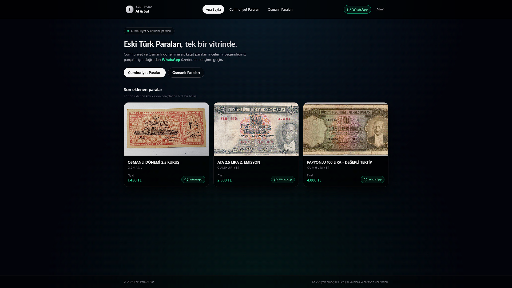
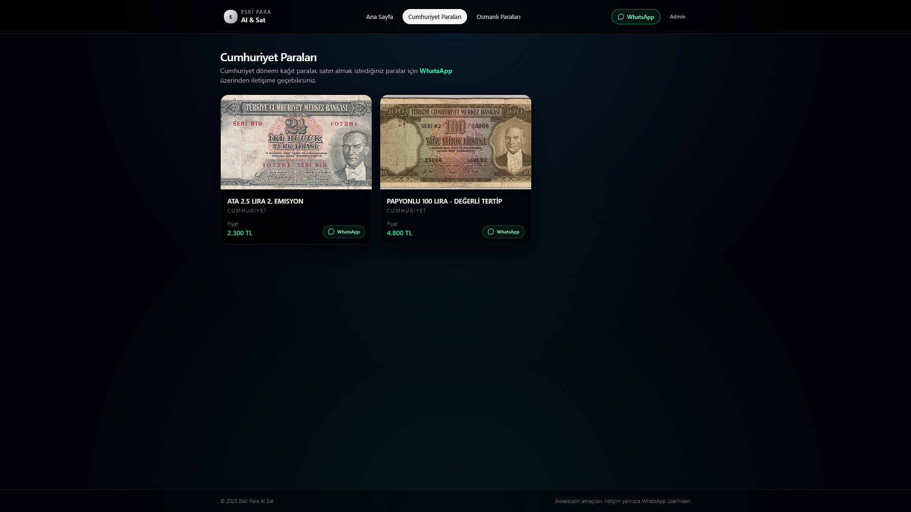
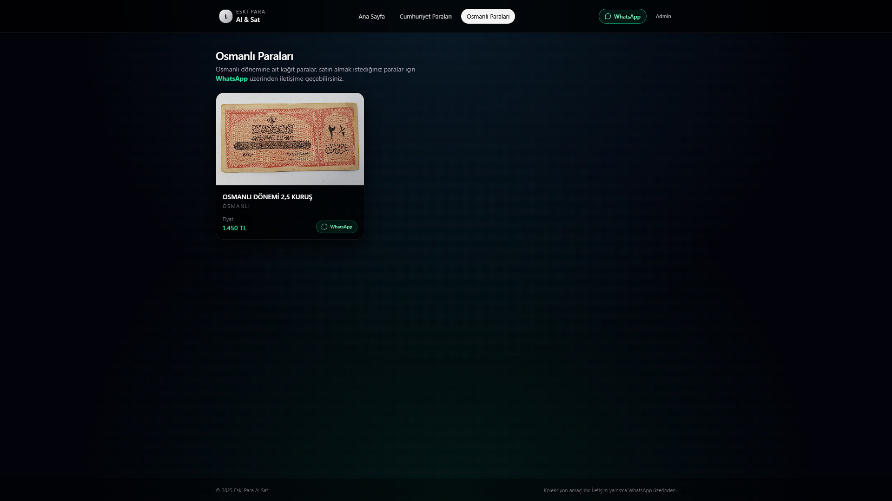
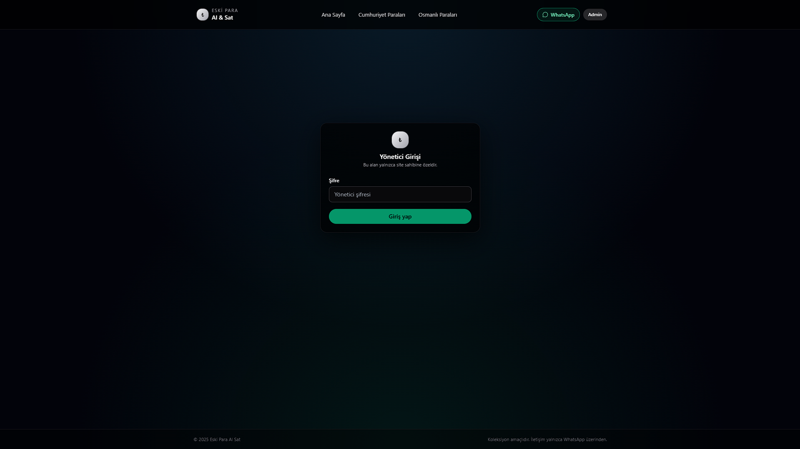
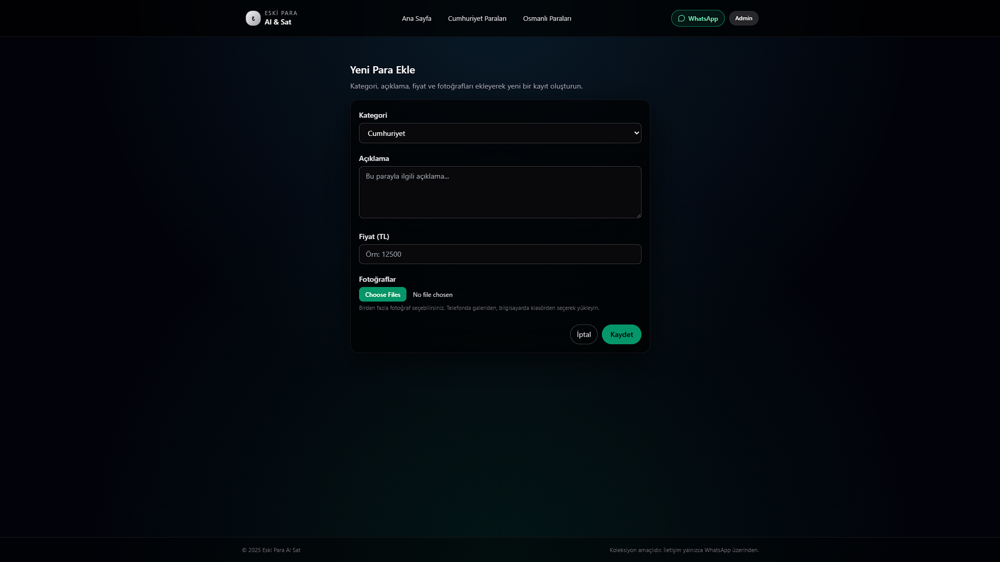
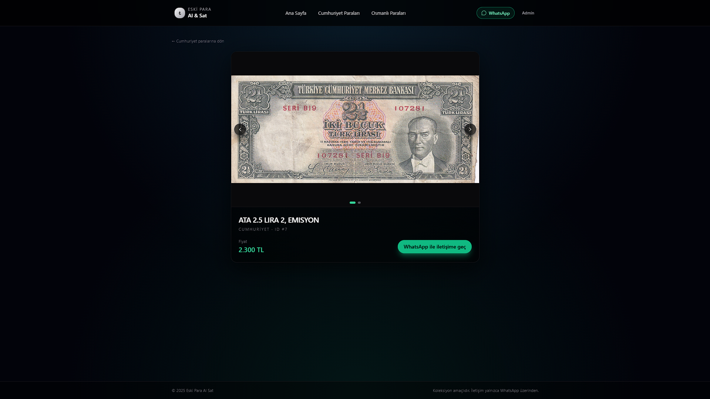

# eskiparaalsat – Eski Para Satış Sitesi

Bu proje, koleksiyonluk Osmanlı ve Cumhuriyet dönemi banknotlarını sergilemek için hazırlanmış modern bir web uygulamasıdır.  
Amaç, satıcıya ait banknotların sade ve şık bir arayüzle ziyaretçilere sunulması ve iletişimin WhatsApp üzerinden hızlıca kurulabilmesidir.

## Özellikler

- Osmanlı ve Cumhuriyet olmak üzere iki kategori desteği  
- Yönetici panelinden:
  - Yeni banknot ekleme  
  - Birden fazla fotoğraf yükleme  
  - Banknot düzenleme ve silme
- Cloudinary üzerinden güvenli fotoğraf yükleme  
- Neon PostgreSQL kullanarak uzak veritabanı yönetimi  
- Modern, koyu temalı ve sade bir kullanıcı arayüzü  
- Banknot detay sayfasında fotoğraf carousel gösterimi  
- Her banknotta WhatsApp bağlantısı ile tek tıkla iletişim

## Kullanılan Teknolojiler

- Next.js 14 (App Router)  
- React Server Actions  
- TypeScript  
- Tailwind CSS  
- Prisma ORM  
- Neon PostgreSQL  
- Cloudinary Upload API

## Proje Görselleri

**1. Ana Sayfa**  

**2. Banknot Listesi – Cumhuriyet**  

**3. Banknot Listesi – Osmanlı**  

**4. Admin Login**  

**5. Admin Panel – Banknot Ekleme**  

**6. Banknot Detay**  

--